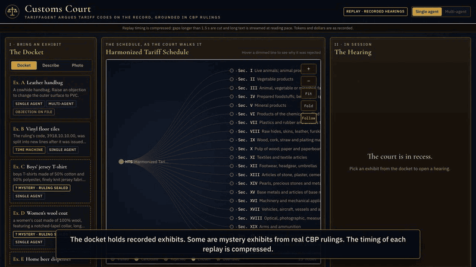

# Customs Court

TariffAgent classifies a product description into a 10-digit US HTS code the way a customs broker would. It applies the General Rules of Interpretation, reads section and chapter notes, grounds the answer in CBP CROSS rulings, and checks whether each ruling it relies on is still in force. It ships as an MCP server, a reusable Agent Skill, a multi-agent "court", deploy-ready AWS and Google Cloud packages, and a courtroom demo.



## What is in the box

| Piece | What it does | Where |
|---|---|---|
| MCP server `tariffagent` | 8 read-only tools over the HTS tree, notes, GRI and 44,139 CROSS rulings with derived status. stdio and stateless Streamable HTTP, one implementation. `--redact-eval` hides evaluation rulings. | `src/tariffagent/mcp_server/` |
| Agent Skill `gri-classification` | The broker workflow in under 2,500 tokens, 9 worked examples from real rulings, and a code validator script. Names the MCP tools it uses. | `skills/gri-classification/` |
| Single agent | Claude (or any provider behind the adapter) with tool use, prompt caching, structured output, a checked final step and one repair turn. | `src/tariffagent/agents/single.py`, `checks.py` |
| Multi-agent court | Orchestrator, parallel heading advocates (read only), one adjudicator that writes the answer. Typed events for the demo. | `src/tariffagent/agents/multi.py` |
| Eval harness | Fixed datasets with sha256 manifests, digit-level accuracy with bootstrap CIs, citation validity, calibration, reference-grounded judge with a second judge, failure taxonomy, cost ledger, response cache. | `src/tariffagent/evals/`, `evals/` |
| Deploy-ready packages | AWS (AgentCore, Bedrock, Terraform) and Google Cloud (Cloud Run, ADK, Vertex). Built and validated locally. **Deploy-ready, not deployed, to keep cost at zero.** | `deploy/` |
| Customs Court demo | Replay-first courtroom UI: live HTS tree, advocate cards, ruling panel, Objection button, Beat the Broker, time machine, cost meter. | `demo/` |

## Results

Test set: the published ATLAS test split (200 CBP rulings). Percentages are exact-match rates with 95% bootstrap intervals. Codes that no longer exist in today's HTS are scored at 6 digits and left out of the 10-digit column. An abstention scores as a miss unless the agent still gave a code.

<!-- results:headline -->
| System | Model | 10-digit | 6-digit | 4-digit | Abstain | Cost per item |
|---|---|---|---|---|---|---|
| ATLAS fine-tuned LLaMA-3.3-70B (published) | paper | 40.0% | 57.5% | | | |
| GPT-5-Thinking (published in ATLAS) | paper | 25.0% | | | | |
| Gemini-2.5-Pro-Thinking (published in ATLAS) | paper | 13.5% | | | | |
| Zero-shot, no tools, all 200 | Claude Sonnet 5 | 21.3% [14.9, 27.6] | 53.0% [46.0, 60.0] | 62.0% [55.5, 68.5] | 13.5% | $0.0061 |
<!-- /results:headline -->

The agent on `subset_80` (80 of the 200 test items, stratified by product type and number of plausible headings), every row on the same items:

<!-- results:subset -->
| System | Model | 10-digit | 6-digit | 4-digit | Abstain | Cost per item |
|---|---|---|---|---|---|---|
| Zero-shot, no tools | Claude Sonnet 5 | 22.7% [12.1, 33.3] | 51.2% [40.0, 62.5] | 53.8% [42.5, 65.0] | 15.0% | $0.0067 |
| TariffAgent single agent (API) | gpt-5-mini | 43.9% [31.8, 56.1] | 51.2% [40.0, 62.5] | 57.5% [46.2, 68.8] | 22.5% | $0.0077 |
| Zero-shot, no tools (in the Claude Code session) | Claude Sonnet 5.5 | 21.2% [12.1, 31.8] | 53.8% [42.5, 65.0] | 63.7% [52.5, 73.8] | 13.8% | $0 (no API spend) |
| TariffAgent single agent (in the Claude Code session) | Claude Opus 5.5 | 51.5% [39.4, 63.6] | 63.7% [52.5, 73.8] | 70.0% [60.0, 80.0] | 20.0% | $0 (no API spend) |
| TariffAgent single agent, rulings limited to before each item's own date (in the Claude Code session) | Claude Sonnet 5.5 | 45.5% [33.3, 57.6] | 61.3% [50.0, 71.2] | 68.8% [57.5, 78.8] | 8.8% | $0 (no API spend) |
<!-- /results:subset -->

<!-- results:subset_diffs -->
| Comparison (paired, same items) | 10-digit | 6-digit |
|---|---|---|
| Agent (Claude in session) minus Claude Sonnet 5 zero-shot | +28.8 points [+16.7, +40.9], n=66 | +12.5 points [+1.2, +23.8], n=80 |
| Agent (Claude in session) minus agent on gpt-5-mini | +7.6 points [-3.0, +18.2], n=66 | +12.5 points [+2.5, +22.5], n=80 |
| Agent (Claude in session) minus Claude Sonnet 5.5 zero-shot (in session) | +30.3 points [+18.2, +43.9], n=66 | +10.0 points [+1.2, +18.8], n=80 |
| Date-limited agent (Claude Sonnet 5.5, in session) minus Claude Sonnet 5.5 zero-shot (in session) | +24.2 points [+12.1, +36.4], n=66 | +7.5 points [-1.2, +16.2], n=80 |
<!-- /results:subset_diffs -->

<!-- analysis:headline -->
What the numbers say:

- **Tools and precedent carry most of the gain.** On the same 80 test items the agent got 51.5% of 10-digit codes right. Claude Sonnet 5.5 with no tools, run the same blind way, got 21.2%, and Claude Sonnet 5 zero-shot got 22.7%. On the fresh set the gap is larger: 82.5% against 15.0%. Without tools, models often find the right heading but miss the last four digits, which need the actual tariff tree.
- **The model is not held fixed.** The tuned API agent ran on Claude Sonnet 5; the test-set agent is Claude Opus 5.5 in the session, and the no-tools control is Claude Sonnet 5.5 (the usage limit ruled out an Opus control). So these rows show that the agent design works, not how much comes from the model. The gap to the gpt-5-mini agent (+7.6 points at 10 digits) has an interval that crosses zero.
- **Why the fresh set scores higher.** Its descriptions come from the ruling's own facts, its labels are the ruling's own current codes (no stale codes, no multi-article mismatch), and recent rulings on similar goods exist. The answer rulings, and any later ruling that names them, are hidden from the tools. The tools can also hide every ruling dated after an item's own ruling (next bullet).
- **Citations hold up.** No invented rulings: 97.5% of 79 citations on the subset and 100% of 42 on the fresh set are valid, in-corpus rulings with the right status.
- **Date-limited rerun.** The first agent runs had no date filter: 22 citations on 20 of the 38 subset items that have a known date, and 1 fresh item, cited a ruling issued after the item's own. The tools now take a per-request as-of date that the model never sees and hide later rulings. The agent rerun with it on (Claude Sonnet 5.5 in the session, all 80 subset and 40 fresh items) cited none, and scored 45.5% on the subset and 85.0% on the fresh set, against 21.2% and 15.0% for the same model with no tools. Only 38 of 80 subset items have a date to limit by (ATLAS does not publish one; it comes from the linked source ruling when the link is confident); the rest run unfiltered. The model differs from the Opus 5.5 row, so the two agent rows do not isolate the filter's effect. The reasoning judges were not rerun on these two runs.
- **Reasoning, not just codes.** A reference-grounded judge passed 67.6% of the subset answers and 90.0% of the fresh answers (details in `docs/EVAL.md`).
- These are 80 items, not the 200 the published ATLAS numbers use, so they are not a like-for-like comparison with that paper.
<!-- /analysis:headline -->

Post-training-cutoff set (150 CBP rulings dated 2026-07-01 or later; the agent ran on a fixed 40-item sample), reported separately:

<!-- results:fresh -->
| System | Model | 10-digit | 6-digit | 4-digit | Abstain | Cost per item |
|---|---|---|---|---|---|---|
| Zero-shot, no tools, all 150 | Claude Sonnet 5 | 20.0% [14.0, 26.7] | 48.0% [40.0, 56.0] | 69.3% [61.3, 76.7] | 1.3% | $0.0060 |
| Zero-shot, no tools, the 40-item sample | Claude Sonnet 5 | 17.5% [7.5, 30.0] | 47.5% [32.5, 62.5] | 67.5% [52.5, 82.5] | 2.5% | $0.0060 |
| Zero-shot, no tools (in the Claude Code session), same 40 | Claude Sonnet 5.5 | 15.0% [5.0, 27.5] | 60.0% [45.0, 75.0] | 70.0% [55.0, 82.5] | 7.5% | $0 (no API spend) |
| TariffAgent single agent (in the Claude Code session), same 40 | Claude Opus 5.5 | 82.5% [70.0, 92.5] | 90.0% [80.0, 97.5] | 92.5% [82.5, 100.0] | 7.5% | $0 (no API spend) |
| TariffAgent single agent, rulings limited to before each item's own date (in the Claude Code session), same 40 | Claude Sonnet 5.5 | 85.0% [72.5, 95.0] | 92.5% [82.5, 100.0] | 92.5% [82.5, 100.0] | 0.0% | $0 (no API spend) |

Paired, same 40 items, agent minus Claude Sonnet 5 zero-shot: 10-digit +65.0 points [+50.0, +80.0], n=40; 6-digit +42.5 points [+27.5, +57.5], n=40.

Paired, same 40 items, agent minus Claude Sonnet 5.5 zero-shot (in session): 10-digit +67.5 points [+52.5, +82.5], n=40; 6-digit +30.0 points [+15.0, +45.0], n=40.

Paired, same 40 items, date-limited agent (Claude Sonnet 5.5) minus Claude Sonnet 5.5 zero-shot (both in session): 10-digit +70.0 points [+55.0, +85.0], n=40; 6-digit +32.5 points [+20.0, +47.5], n=40.
<!-- /results:fresh -->

How the budget shaped these numbers, plainly:
- The agent was built, tuned and error-analyzed with Claude Sonnet 5 through the API on the dev split. The API budget ran out before the Claude agent ran on the test set.
- The test-set agent run was then done blind by Claude Opus 5.5 working inside the Claude Code session (covered by the user's plan, no API spend), using the same tools (MCP server with `--redact-eval`), the same skill, the same final checks and the same scorer. It read only a descriptions-only file. It is labeled separately from the API runs.
- The no-tools controls (Claude Sonnet 5.5) and both reasoning judges (Claude Opus 5.5 and Claude Haiku 4.5) also ran in the session, the same blind way.
- The multi-agent vs single-agent study ran only on 10 dev items before the budget ran out; see `docs/CASE_STUDY.md`.

Cost:

<!-- results:cost -->
| | USD |
|---|---|
| Paid API spend, whole project | $13.34 |
| Same calls at list price, no caching, no batch discount | $39.71 |
| Saving from prompt caching and the Batch API | 66.4% |
| Share of input tokens read from the prompt cache | 81.4% |
| Blind test and fresh runs, and judging (in the Claude Code session) | $0 API spend |
<!-- /results:cost -->

Every number above comes from a file in `evals/reports/` (`scripts/number_audit.py` checks this). Full write-up: `docs/CASE_STUDY.md`.

## MCP quickstart

```bash
git clone https://github.com/Rohanjain2312/customs-court && cd customs-court
uv sync --extra embed
make data   # builds data/tariffagent.sqlite from USITC and CBP CROSS (cached, resumable, polite)
```

Tools: `hts_navigate`, `hts_search`, `get_notes`, `get_gri`, `cross_search`, `get_ruling`, `ruling_status`, `hts_revision_diff`. Resources: `hts://gri`, `hts://notes/chapter/{chapter}`. All corpus text comes back inside `untrusted_corpus_text` objects, and documents that try to instruct an AI model are flagged.

stdio:

```bash
uv run tariffagent-mcp --transport stdio
```

Streamable HTTP (stateless, endpoint `http://127.0.0.1:8000/mcp`):

```bash
uv run tariffagent-mcp --transport http --host 127.0.0.1 --port 8000
```

Claude Code:

```bash
claude mcp add tariffagent -- uv run --directory /path/to/customs-court tariffagent-mcp --transport stdio
```

Claude Desktop (`~/Library/Application Support/Claude/claude_desktop_config.json`):

```json
{
  "mcpServers": {
    "tariffagent": {
      "command": "uv",
      "args": ["run", "--directory", "/path/to/customs-court", "tariffagent-mcp", "--transport", "stdio"]
    }
  }
}
```

## Install the skill

Copy `skills/gri-classification/` into your skills folder (for Claude Code, `~/.claude/skills/` or the project's `.claude/skills/`). The skill calls the MCP tools above; `scripts/validate_hts.py` checks a final code with the standard library only.

## Run the demo

```bash
uv sync --extra demo
make replay     # no API key, no network, no spend: recorded hearings with compressed timing
```

Live mode (`make demo`) needs `ANTHROPIC_API_KEY` and stops each browser session at $2.

## Reproduce the evals

Every model response is stored in an on-disk cache keyed by the full request, so re-running a finished eval costs nothing.

```bash
make test         # offline, recorded responses
make eval-smoke   # re-scores committed runs and replays a recorded classification
uv run tariffagent eval run --dataset atlas_test_200 --arm A --mode batch   # Claude, spends money
uv run python scripts/results_tables.py   # rebuild every table in the docs from evals/reports
```

## Deploy-ready, not deployed

`make build-deploy-aws` and `make build-deploy-gcp` build the images and validate them locally (MCP calls against the running containers, `terraform validate`, the ADK agent against the local MCP server). `make deploy-aws` and `make deploy-gcp` print a cost estimate from the current pricing pages and refuse to run unless `I_ACCEPT_CLOUD_COSTS=yes`. Nothing was deployed, so nothing was billed. See `docs/ARCHITECTURE.md` and `docs/SECURITY.md`.

## Docs

`docs/CASE_STUDY.md` (results and what they mean), `docs/EVAL.md` (data, datasets, metrics, error analysis), `docs/ARCHITECTURE.md` (components, diagrams, cloud designs), `docs/SECURITY.md`, `docs/WALKTHROUGH.md` (5 and 12 minute talk tracks).

## License

MIT
