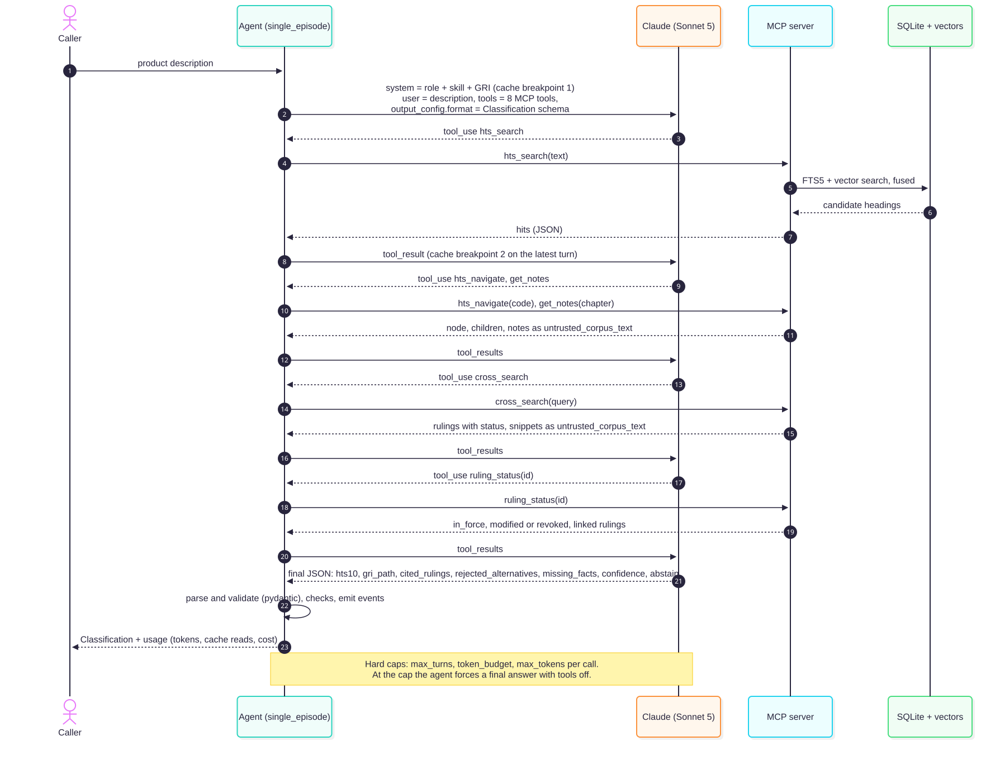

# Architecture


## Agent Skill: `gri-classification`

Location: `skills/gri-classification/`

```
SKILL.md                               front matter + broker workflow (2,459 tokens)
references/examples.md                 9 worked examples from real CROSS rulings
references/gri-3b-composites-and-sets.md
references/parts-and-accessories.md
references/ruling-status.md
scripts/validate_hts.py                format and existence check (local DB or USITC API)
```

### What we borrowed

From the Agent Skills specification (agentskills.io/specification, read 2026-09-28):
- Front matter with `name` (lowercase, hyphens, matches the directory) and a `description` that says what the skill does and when to use it, with trigger keywords. Optional `license`, `compatibility` and `metadata` fields.
- Progressive disclosure: short metadata, a body under 5,000 tokens (ours is 2,459), detail pushed into `references/`, code in `scripts/`.
- File references one level deep from `SKILL.md`.
- Scripts that are self-contained, give helpful errors and handle edge cases (`validate_hts.py` uses only the standard library and returns exit code 2 when it cannot check).

From anthropics/skills (the `mcp-builder` skill in particular, read 2026-09-28):
- A numbered workflow with named phases, and references loaded only when a case needs them.
- Naming the exact tools the skill expects, so the skill and the MCP server work as one unit. Every step in our workflow names its MCP tool.

`src/tariffagent/agents/skill.py` loads the skill and checks the specification rules (name format and match, description length, compatibility length, referenced files exist). `tests/test_agent_e2e.py::test_skill_loads_and_is_valid` runs those checks.

### How the agent uses it

The skill body is part of the cached static prefix of every agent call (system prompt, skill body, GRI text). The worked examples were chosen from rulings dated before 2026-07-01 and outside every evaluation set, and none shares an 8-digit code with an ATLAS test or validation gold code, so the references cannot leak answers.

## Components and data flow



Source: [`diagrams/components.mmd`](diagrams/components.mmd).

| Component | Code | Role |
|---|---|---|
| MCP server `tariffagent-mcp` | `src/tariffagent/mcp_server/` | 8 read-only tools over stdio or stateless Streamable HTTP at `/mcp`. One implementation (`TariffTools`) behind both transports. |
| Data | `data/tariffagent.sqlite`, `data/index/` | HTS tree and notes per revision, CROSS rulings with derived status, FTS5 tables, local `bge-small` vectors. Public data. |
| Agents | `src/tariffagent/agents/` | Single agent (arms A, B, C, Z) and the multi-agent team (orchestrator, parallel advocates, one adjudicator). Same tool executor, same typed events. |
| Skill | `skills/gri-classification/` | Broker workflow in the cached system prefix, together with the GRI text. |
| Providers | `src/tariffagent/llm/` | Anthropic (live), OpenAI (subset), Bedrock and Vertex (mocked code paths, used by the deploy packages). |
| Harness and demo | `src/tariffagent/evals/`, `demo/` | Consume the agents and their events. |

Data flow for one request: a product description enters an agent. The agent sends the
static prefix (role, skill, GRI) plus the conversation to the model, and runs the tool
calls the model asks for against the MCP tools (in process for evals, over MCP for
clients and the cloud packages). Tools read SQLite and the vector index and wrap every
piece of corpus text as `untrusted_corpus_text`. The model's final JSON is validated
against the `Classification` schema, checked (`agents/checks.py`), and returned with
token usage. Every step is also emitted as a typed event for traces and the demo.

## One classification, step by step



Source: [`diagrams/classification_sequence.mmd`](diagrams/classification_sequence.mmd).
This is the single agent (arm A), the path both cloud agent entrypoints wrap.

1. The caller sends a description. The agent builds the request: system blocks (role,
   skill body, GRI text) with a cache breakpoint at the end, the 8 tool definitions, and
   the `Classification` JSON schema as structured output.
2. The model asks for `hts_search`. The MCP server runs FTS5 and vector search, fuses
   them, and returns candidate headings and subheadings.
3. The model navigates the best candidates (`hts_navigate`) and reads the chapter or
   section notes (`get_notes`). Notes come back as `untrusted_corpus_text`.
4. The model searches rulings (`cross_search`) and checks every ruling it wants to cite
   (`ruling_status`: in force, modified or revoked, and which ruling changed it).
5. Each turn moves the second cache breakpoint to the latest message, so the next turn
   reads the conversation from the cache.
6. The model returns the final JSON. The agent validates it, runs the deterministic
   checks (current 10-digit line, parts rules, cited rulings exist and are not flagged),
   and allows one repair turn if a check fails.
7. Hard caps stop runaway loops: `max_turns`, a token budget, and `max_tokens` per call.
   At the cap the agent asks for the final answer with tools turned off.

## Deployment: AWS

Status: deploy-ready, not deployed, to keep cost at zero. Everything below was built and
run locally; nothing was created in an AWS account.



Source: [`diagrams/aws_architecture.mmd`](diagrams/aws_architecture.mmd).

### Platform facts checked on 2026-09-28

| Fact | Source |
|---|---|
| MCP servers run at `0.0.0.0:8000/mcp`, streamable HTTP; stateless recommended, stateful also supported | [runtime-mcp.html](https://docs.aws.amazon.com/bedrock-agentcore/latest/devguide/runtime-mcp.html), [runtime-mcp-protocol-contract.html](https://docs.aws.amazon.com/bedrock-agentcore/latest/devguide/runtime-mcp-protocol-contract.html) |
| In stateless mode the platform adds an `Mcp-Session-Id` header and the server must not reject it | same |
| HTTP agents: `0.0.0.0:8080`, `POST /invocations`, `GET /ping` returning `{"status": "Healthy"}` | [runtime-http-protocol-contract.html](https://docs.aws.amazon.com/bedrock-agentcore/latest/devguide/runtime-http-protocol-contract.html) |
| All runtime containers must be `linux/arm64` | same, and [getting-started-custom.html](https://docs.aws.amazon.com/bedrock-agentcore/latest/devguide/getting-started-custom.html) |
| Inbound auth: IAM SigV4 by default, or a JWT authorizer; one runtime takes one of the two, not both. A workload identity is created for each runtime | [runtime-oauth.html](https://docs.aws.amazon.com/bedrock-agentcore/latest/devguide/runtime-oauth.html) |
| Gateway can front a runtime-hosted MCP server and sign outbound calls with its role (service `bedrock-agentcore`) | [gateway-target-MCPservers.html](https://docs.aws.amazon.com/bedrock-agentcore/latest/devguide/gateway-target-MCPservers.html) |
| Gateway tool names are `<target name>___<tool name>` | [gateway-tool-naming.html](https://docs.aws.amazon.com/bedrock-agentcore/latest/devguide/gateway-tool-naming.html) |
| Observability: ADOT (`aws-opentelemetry-distro>=0.18.0`) plus CloudWatch Transaction Search (account-wide, one time); gateway logs need a vended log delivery | [observability-configure.html](https://docs.aws.amazon.com/bedrock-agentcore/latest/devguide/observability-configure.html) |
| The Anthropic SDK's Mantle client uses `bedrock-mantle`, which has its own IAM action `bedrock-mantle:CreateInference`; AWS recommends the `bedrock-runtime` endpoint for new applications | [inference-messages-api.html](https://docs.aws.amazon.com/bedrock/latest/userguide/inference-messages-api.html) |
| Terraform resource types exist in `hashicorp/aws` 6.66.0: `aws_bedrockagentcore_agent_runtime`, `_gateway`, `_gateway_target`, `_resource_policy`, `_workload_identity`, plus `aws_cloudwatch_log_delivery*` and `aws_xray_trace_segment_destination` | `terraform providers schema -json` on 6.66.0 |

### What is in the package

| Path | What |
|---|---|
| `deploy/aws/Dockerfile` | MCP server image, ARM64, non-root, read-only data, `REDACT_EVAL=true`. `VECTORS=1` bakes the embedding model for the real data. |
| `deploy/aws/Dockerfile.agent`, `agentcore_agent/`, `requirements.txt` | Agent image: FastAPI `/invocations` and `/ping`, the project's single agent, `BedrockProvider`, MCP client with SigV4 to the gateway, ADOT when `AGENT_OBSERVABILITY_ENABLED=true`. |
| `deploy/aws/terraform/` | ECR (2 repos), IAM (3 roles), MCP runtime (MCP, IAM inbound, resource policy: gateway role only), gateway (`AWS_IAM` inbound, MCP target with SigV4 outbound), agent runtime (HTTP, IAM or JWT inbound), gateway log and trace delivery, optional Transaction Search. |
| `deploy/aws/build_and_validate.sh` | `make build-deploy-aws`. |
| `deploy/aws/deploy.sh`, `destroy.sh` | Real scripts. Print the cost estimate, refuse without `I_ACCEPT_CLOUD_COSTS=yes`. |

### Local validation (run 2026-09-28, `make build-deploy-aws`, exit 0)

- Data: the 12 MB test fixture (`scripts/export_deploy_data.py --fixture`, 79 rulings, full
  2026 HTS tree), BM25 only. The real export is 880 MB of SQLite plus 57 MB of vectors;
  its image was built once separately (`VECTORS=1`, arm64): 3.33 GB unpacked, 0.73 GB
  compressed. That container answered after 5.9 s, passed the tool checks, found the
  expected chapter for 5 of 5 smoke products, and used 647 MiB of memory after the smoke
  test.
- Images: `tariffagent-mcp:aws-local` 455 MB, `tariffagent-agent:aws-local` 536 MB
  (arm64, uncompressed as reported by `docker image ls`).
- MCP container: all 8 tools called through the MCP SDK client; eval ruling N326421
  hidden; a POST carrying a made-up `Mcp-Session-Id` accepted (the stateless contract);
  a foreign Host header rejected with HTTP 421 when `MCP_ALLOWED_HOSTS` is set.
- Smoke test, MCP part: the expected chapter was among the `hts_search` candidates for
  4 of 5 products. The porcelain mug missed (top hits in chapter 39); this is BM25 without
  vectors on the fixture. The real-data image with vectors found all 5 (first bullet), which is
  why deploy.sh builds with `VECTORS=1`.
- Agent container with `AGENT_MODEL_MODE=scripted`: `/ping` healthy; `/invocations` ran
  the single agent, which called `hts_search`, `hts_navigate`, `cross_search` and
  `ruling_status` over MCP against the MCP container. Every request the real
  `BedrockProvider` built used model id `anthropic.claude-sonnet-5` on
  `bedrock-mantle.us-east-1.api.aws`, carried a cache breakpoint on the system prompt,
  and asked for structured output. The mock transport answered, so no AWS call was made
  and the classification is scripted, not model output.
- `terraform init -backend=false` and `terraform validate`: valid. No plan, no apply.
- Local start time (laptop, arm64, fixture image): MCP server answered after 2.3 to 6.1 s,
  agent `/ping` after 1.1 to 1.3 s.

## Deployment: GCP

Status: deploy-ready, not deployed, to keep cost at zero.



Source: [`diagrams/gcp_architecture.mmd`](diagrams/gcp_architecture.mmd).

### Platform facts checked on 2026-09-28

| Fact | Source |
|---|---|
| Cloud Run runs Linux x86_64 images, listening on `0.0.0.0:$PORT` (default 8080) | [run/docs/container-contract](https://docs.cloud.google.com/run/docs/container-contract) |
| Service-to-service auth: Google-signed ID token with the service URL as audience, caller holds `roles/run.invoker` | [run/docs/authenticating/service-to-service](https://docs.cloud.google.com/run/docs/authenticating/service-to-service) |
| Requests denied by IAM are not billed | [Cloud Run pricing](https://cloud.google.com/run/pricing) |
| Agent Runtime (formerly Agent Engine) deploys an ADK agent wrapped in `AdkApp` with `vertexai.Client(...).agent_engines.create(agent=..., config=...)`; config fields include `requirements`, `extra_packages`, `staging_bucket`, `env_vars`, `service_account`, `min_instances`, `max_instances`, `resource_limits` | [agent-engine/deploy](https://docs.cloud.google.com/vertex-ai/generative-ai/docs/agent-engine/deploy) and the installed SDK (`google-cloud-aiplatform` 2.2.0) |
| `min_instances` defaults to 1 (range 0 to 10) | `AgentEngineConfig` field docs in the SDK |
| ADK 2.10.0: `LlmAgent`, `SequentialAgent`, `ParallelAgent`, `McpToolset` with `StreamableHTTPConnectionParams` and a `header_provider`; `google.adk.models.anthropic_llm.Claude` serves Claude from Vertex AI and adds cache breakpoints when the `App` has a `ContextCacheConfig` | installed package source |

### The ADK agent

`deploy/gcp/tariff_adk/agent.py` builds the multi-agent design from
`src/tariffagent/agents/multi.py` as an ADK tree:
`SequentialAgent(orchestrator, ParallelAgent(advocate_1..3), adjudicator)`. The
orchestrator writes `state["plan"]`, each advocate reads its heading from the plan and
writes `state["memo_i"]` (slots without a heading are skipped by a callback, no model
call), and the adjudicator is the only writer of `state["classification"]`. Each role
gets the same MCP tool allow list as in `multi.py` through `tool_filter`. Tools come from
the Cloud Run MCP server with a Google ID token per session (`tariff_adk/auth.py`).

Prompts are not copied: `deploy/gcp/build_assets.py` exports the role texts, skill, GRI
text, schemas and Vertex model ids from the `tariffagent` package into
`tariff_adk/_assets.json`. Models default to ADK's own `Claude` class (Claude Sonnet 5
for the adjudicator, Haiku 4.5 for the others, on Vertex AI). The project's
`VertexClaudeProvider` is not used here, because ADK needs a `BaseLlm`; the model ids
come from the same mapping (`tariffagent.llm.cloud.VERTEX_MODEL_IDS`).

Memory Bank: skipped. The classifier works per product and needs no memory across
sessions to do its job. The one plausible use, remembering an importer's product facts,
would store private SKU data in a managed service with its own retention and billing
(Memory Bank storage and operations billing started 2026-09-01), and nothing in the evals
shows it would improve accuracy. The "missing facts" flow already asks the caller for the
facts it needs. Sessions (conversation state inside one session) are used, because
`AdkApp` manages them.

### Local validation (run 2026-09-28, `make build-deploy-gcp`, exit 0)

- MCP image `tariffagent-mcp:gcp-local`: amd64, 434 MB uncompressed. Built under
  emulation on an ARM laptop. Run with `PORT=8080` as Cloud Run would; all 8 tools, the
  redaction check and the stateless `Mcp-Session-Id` check passed; smoke test MCP part 4/5
  (same mug miss as on AWS).
- `service.yaml` parses; port 8080 matches the image; `minScale: 0`; request-based
  billing; no public member in the spec or in `deploy.sh`.
- ADK agent run locally in an isolated venv (`deploy/gcp/.venv`: google-adk 2.10.0,
  google-cloud-aiplatform 2.2.0) with scripted models against the MCP container: the
  orchestrator called `hts_search`, two advocates called `get_notes`, `hts_navigate`,
  `cross_search` and `ruling_status`, the adjudicator called `hts_navigate`; 10 tool
  results, none an error; plan, memos and a schema-complete classification in session
  state. The answers are scripted, not model output. The tree also wraps in `AdkApp`
  (constructed with a placeholder project id, not deployed).
- Not run: the ID-token path (needs Google credentials), Claude on Vertex, Agent Runtime.

## Comparing the two designs

Numbers marked "expected" were not measured, because nothing was deployed.

| | AWS (AgentCore) | GCP (Cloud Run + Agent Runtime) |
|---|---|---|
| Hosting of the agent | Our container (FastAPI) on AgentCore Runtime, HTTP contract | ADK agent object pickled and hosted by Agent Runtime |
| Hosting of the MCP server | AgentCore Runtime (MCP protocol) behind AgentCore Gateway | Cloud Run service |
| Agent shape deployed | Single agent (arm A), same code as the eval harness | Multi-agent team rebuilt in ADK (orchestrator, advocates, adjudicator) |
| Setup effort | Higher: 2 images, ECR, 3 IAM roles, a resource policy, gateway target, log delivery; 24 Terraform resource blocks | Lower for infra: 1 image, 1 service spec, 2 service accounts; the agent needs an ADK port of the prompts and a separate venv |
| Auth chain | Caller -> agent: SigV4 or JWT. Agent -> gateway: SigV4. Gateway -> MCP runtime: SigV4 with the gateway role, all other principals denied | Caller -> agent: Google IAM. Agent -> Cloud Run: ID token + `run.invoker` for one service account |
| Expected cold start | Expected: microVM start plus image pull; several seconds for the agent, longer for the real MCP image (0.73 GB compressed, embedding model loads at start). Not measured in AWS. Locally the fixture images answer in 1 to 6 s, the real-data image in 5.9 s | Expected: Cloud Run cold start plus loading the embedding model, several seconds, eased by startup CPU boost. Agent Runtime with `min_instances: 0` adds its own start. Not measured |
| Expected monthly cost, 1,000 classifications | About $38.4, of which about $36 is model tokens and $0.09 is fixed (ECR, tool indexing). `deploy/cost_estimate.py aws` | About $36.9, of which about $36 is model tokens and $0.02 is fixed (Artifact Registry). Cloud Run stays in its free tier at this volume. `deploy/cost_estimate.py gcp` |
| Cost with zero traffic | Expected about $0.09 per month (runtimes scale to zero) | Expected about $0.02 per month, if Agent Runtime accepts `min_instances: 0`; the SDK default of 1 may bill an idle instance |
| Observability | CloudWatch GenAI Observability: runtime logs by default, ADOT spans from the agent, gateway logs and traces through vended delivery. Needs account-wide Transaction Search | Cloud Logging and Cloud Trace for Cloud Run and Agent Runtime by default; ADK emits OpenTelemetry spans |
| Gotchas from the docs | Gateway renames tools to `<target>___<tool>` (the agent strips it with `MCP_TOOL_PREFIX`). Mantle needs `bedrock-mantle:CreateInference`, not `bedrock:InvokeModel`. A runtime takes IAM or JWT, not both. Transaction Search is account-wide | Cloud Run needs x86_64 images, so a separate build from AWS's ARM64. Agent Runtime pickles the agent, so objects in it must pickle (the ID-token helper drops its lock and token). `min_instances` defaults to 1 |
| Gotchas from local validation | A leftover container held a port; the scripts now use configurable ports. The AgentCore `/ping` body must not set `time_of_last_update` on every call | amd64 build under emulation on an ARM Mac is slower. `AdkApp` needs a project id even to construct; ADK looks for Google ADC during MCP session setup and logs a warning without it |
| Model access | Claude on Bedrock via the project's `BedrockProvider` (cache breakpoints, structured output) | Claude on Vertex via ADK's `Claude` class (cache breakpoints through `ContextCacheConfig`) |
